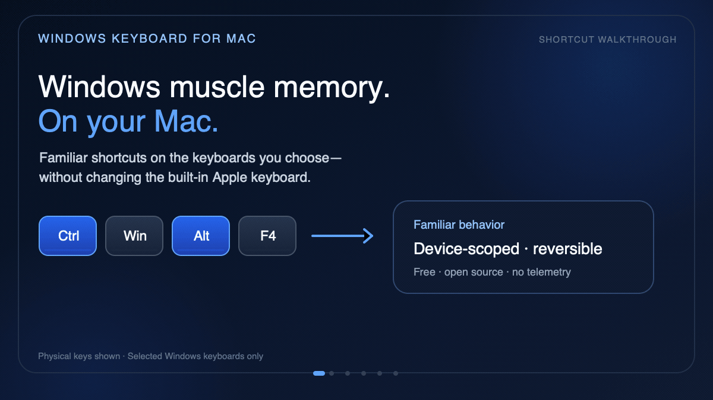

# Windows Keyboard for Mac

**Keep your Windows-keyboard muscle memory on macOS—on every keyboard or only
the Windows keyboards you choose.**

[](https://github.com/Fuzzy-and-Fluffy/windows-keyboard-for-mac/releases/latest)
[](https://github.com/Fuzzy-and-Fluffy/windows-keyboard-for-mac/actions/workflows/ci.yml)
[](./LICENSE)
[](https://ke-complex-modifications.pqrs.org/)

[](https://fuzzy-and-fluffy.github.io/windows-keyboard-for-mac/demo/)

**[Open the interactive demo](https://fuzzy-and-fluffy.github.io/windows-keyboard-for-mac/demo/)**
to pause, move to the previous or next scene, or use the arrow keys. The GIF
keeps each scene visible for 7–9 seconds.

Windows Keyboard for Mac is a free, open-source Karabiner-Elements shortcut
layer. Its community edition has been accepted into the official
Karabiner-Elements community rules catalog. It gives macOS familiar `Ctrl`,
`Alt+Tab`, `Alt+F4`, Finder, Terminal, screenshot, window-tiling, Home/End, and
F1–F12 behavior without relying on a global macOS modifier-key swap.

**[Install from the Karabiner community catalog](#choose-an-edition)**
· **[Download the device-scoped edition](https://github.com/Fuzzy-and-Fluffy/windows-keyboard-for-mac/releases/latest)**
· [Quick start](./docs/quick-start.md)
· [Shortcut matrix](./docs/shortcut-matrix.md)

> Both editions require macOS 15 or newer and Karabiner-Elements 16 or newer.
> The downloadable device-scoped edition remains an unsigned GitHub preview.

## Choose an edition

| Edition | Best for | Keyboard scope | Install and recovery |
|---|---|---|---|
| **Community catalog** | A Windows-style shortcut layer on every keyboard, including a MacBook keyboard | All keyboards | Import one predefined rule from Karabiner-Elements |
| **Device-scoped GitHub edition** | Converting only selected external Windows keyboards | Only keyboard models selected during setup | Guided installer with discovery, backup, diagnostics, verification, and rollback |

### Community catalog: all keyboards

1. Open Karabiner-Elements → **Complex Modifications**.
2. Choose **Add predefined rule** → **Import more rules from the internet**.
3. Search for **Windows Keyboard for Mac (community edition)**, import it, and
   enable **Windows Keyboard for Mac: complete Windows-style shortcuts (all
   keyboards)**.

This edition deliberately applies to every keyboard. Use the device-scoped
edition below if the MacBook keyboard or any other keyboard should retain
native macOS shortcuts.

### Device-scoped GitHub edition: selected Windows keyboards

1. Install and open [Karabiner-Elements](https://karabiner-elements.pqrs.org/),
   then approve its required macOS permissions.
2. Connect the Windows keyboard and
   [download the latest release](https://github.com/Fuzzy-and-Fluffy/windows-keyboard-for-mac/releases/latest).
3. Extract it, Control-click `install.command`, choose **Open**, and select the
   keyboard or keyboards to convert.

## What it gives you

- Windows-style editing, app switching, window closing, navigation, screenshots,
  and native macOS window tiling.
- Finder-specific rename, open, delete, move, and Backspace behavior that does
  not hijack filename or search-field editing.
- Terminal shortcuts that preserve real `Ctrl+C` interrupts and remote-desktop
  rules that send the expected physical modifiers.
- Device-scoped enrollment: the MacBook keyboard, Apple keyboards, virtual
  keyboards, and unselected keyboards remain unchanged.
- Automatic backup, live installation verification, diagnostics, rollback, and
  a reversible uninstaller.
- No telemetry, no account, and no app-specific personal shortcuts.

## Why this architecture

The selected keyboard receives four device-level Simple Modifications. When a
Mac app shows a shortcut using Apple symbols, use this reverse lookup:

| Mac key shown by the app | Physical Windows-keyboard key |
|---|---|
| `⌘ Command` | `Ctrl` |
| `⌃ Control` | `Windows` key |
| `⌥ Option` | `Alt` |
| `⇧ Shift` | `Shift` |

So a Mac shortcut shown as `⌥⇧F` is pressed as `Alt+Shift+F` on the
Windows keyboard, while `⌘C` is pressed as `Ctrl+C`. The Windows keyboard does
have an Option equivalent: its `Alt` key.

Karabiner applies Simple Modifications before Complex Modifications. This means common shortcuts such as `Ctrl+C`, `Ctrl+V`, `Ctrl+S`, `Ctrl+Z`, and `Ctrl+Shift+4` naturally become the macOS Command equivalents. Complex rules are reserved for shortcuts whose meaning differs between Windows and macOS.

Explicit Windows Keyboard for Mac shortcuts take priority over this general lookup. For
example, physical `Win+Space` is reserved for input-source switching. When
choosing a third-party app shortcut, avoid combinations already listed in the
shortcut matrix.

Every Complex Modification also contains a `device_if` condition. The rules therefore do not leak onto the built-in Apple keyboard or another keyboard that was not selected during installation.

## Requirements

- macOS 15 or newer;
- Karabiner-Elements 16 or newer;
- one connected non-Apple physical keyboard;
- macOS Modifier Keys set to their defaults;
- no active `hidutil UserKeyMapping`.

Karabiner needs macOS Input Monitoring, Accessibility, background-service, and DriverKit approvals. Apple requires the user to grant these permissions; no legitimate installer can silently bypass them.

## Install

For the complete early-tester workflow, read
[`docs/quick-start.md`](./docs/quick-start.md).
Prebuilt preview archives are available from
[GitHub Releases](https://github.com/Fuzzy-and-Fluffy/windows-keyboard-for-mac/releases).

1. Install and open [Karabiner-Elements](https://karabiner-elements.pqrs.org/), then finish its macOS permission prompts.
2. Connect the Windows keyboard.
3. Double-click [`install.command`](./install.command).

If exactly one non-Apple keyboard is connected, it is selected automatically. If several are connected, the installer asks which keyboard(s) to convert.

The generated rules are not tied to Microsoft. Logitech, Dell, HP, Keychron-in-Windows-mode, and other standard USB/Bluetooth HID keyboards can use the same shortcut layer. The installer records each selected keyboard by its reported vendor and product IDs.

To add another keyboard later, connect it and double-click [`add-keyboard.command`](./add-keyboard.command). Existing registered keyboards are retained even if they are disconnected at the time. Re-running `install.command` has the same additive behavior.

The installer also reads that Mac's enabled **Input Sources** system shortcut and uses it behind physical `Win+Space`. Spotlight actions open the Spotlight app directly rather than assuming `Command+Space` or `Option+Space`. This lets the same package follow each Mac's existing shortcut customization.

The installer stops without changing anything if it finds a macOS Modifier Keys mapping or an active `hidutil` mapping. This prevents the inconsistent “two remappers both touching Ctrl/Command” state.

For a terminal-driven install:

```zsh
./install.command --non-interactive --device 1234:5678
```

Use the vendor and product IDs shown by:

```zsh
'/Library/Application Support/org.pqrs/Karabiner-Elements/bin/karabiner_cli' --list-connected-devices
```

## Diagnose

Double-click [`doctor.command`](./doctor.command), or run:

```zsh
./doctor.command --non-interactive
```

The diagnostic checks Karabiner availability and version, the live profile, target devices, rule isolation, macOS Modifier Keys conflicts, and `hidutil UserKeyMapping`.

## Uninstall or roll back

Double-click [`uninstall.command`](./uninstall.command).

The uninstaller removes only the `Windows Keyboard for Mac` profile and reselects the profile that was active before installation. It backs up the current config before making the change. Historical backups are kept in:

```text
~/.config/karabiner/windows-keyboard-for-mac-backups/
```

If live profile activation or restoration fails, the installer/uninstaller automatically restores the pre-operation configuration.

## Shortcut coverage

See [`docs/shortcut-matrix.md`](./docs/shortcut-matrix.md) for the complete behavior summary.

Highlights:

- common Windows `Ctrl` editing shortcuts work automatically;
- physical `Win+Space` switches input source;
- the public profile does not reserve `Ctrl+Space` for a particular app; users can choose their own dictation shortcut;
- `Ctrl+Shift+3/4/5` invoke the corresponding macOS screenshot shortcuts;
- `Win+Shift+S` captures a selected area;
- `Alt+Tab` switches apps, while `Alt+F4` closes the active top-level browser or Finder window instead of merely closing its current tab;
- the selected Windows keyboard keeps `F1` through `F12` as standard function keys even when macOS media-key mode is enabled;
- Windows-style Home/End is translated while editing text and otherwise
  passes through for native page navigation; Ctrl+Arrow and word deletion are
  translated;
- Finder gets Windows-style cut/move, Enter, F2, Delete, Shift+Delete and Backspace behavior without hijacking filename or search-field editing;
- terminal apps get raw Ctrl sequences and `Ctrl+Shift+C/V/N/T/W`;
- listed remote desktop/VM clients receive physical Ctrl and Windows modifiers natively;
- `Win+Left/Right/Up/Down` uses native macOS 15+ window tiling.

## MVP versus a distributable product

This repository is a functional, reversible MVP. A friend can use it after installing Karabiner, but the `.command` bundle is not yet code-signed or notarized.

The next product-quality packaging step is a signed and notarized SwiftUI `.app` or `.pkg` that embeds the same profile generator and adds:

- a visual keyboard picker and shortcut test screen;
- a hot-plug prompt that offers to enroll a newly connected non-Apple keyboard;
- guided links to each required macOS permission;
- update checks and versioned migrations;
- a shortcut conflict detector and opt-in per-user overrides without shipping app-specific defaults;
- Standard, Developer, and Remote Desktop presets;
- signed releases so Gatekeeper does not show an unidentified-developer warning.

Even that app will still require the one-time Apple permission approvals for Karabiner.

## Build and test

The distributable profile is generated from readable JavaScript without third-party packages:

```zsh
npm run build
npm test
```

The tests cover profile generation, device scoping, JSON-with-comments input, install/readback, diagnostics, uninstall/restore, backups, and automatic rollback after a simulated live activation failure.

## Privacy and public distribution

Windows Keyboard for Mac does not contain app-specific defaults, user names, email
addresses, local file paths, or a pre-enrolled keyboard. It does not include
telemetry or make network requests. The installer stores only the selected
keyboard model identifiers and rollback state in the user's local Karabiner
configuration directory.

Run the public-distribution audit and build a release archive with:

```zsh
npm run audit
npm run package
```

The packaging command produces a ZIP and a SHA-256 checksum under `release/`.
See [`docs/privacy.md`](./docs/privacy.md) and
[`docs/releasing.md`](./docs/releasing.md) before publishing a GitHub Release.

The preview release intentionally remains unsigned rather than exposing an
individual signing identity. See [`docs/signing.md`](./docs/signing.md) for the
future organization-signed App plan.

## Prior art and references

The shortcut semantics were compared with the public-domain [rux616/karabiner-windows-mode](https://github.com/rux616/karabiner-windows-mode) project. Windows Keyboard for Mac uses a different delivery architecture: device-level modifier translation, automatic device detection, dedicated-profile installation, conflict checks, live readback, and rollback.

Relevant Karabiner documentation:

- [Input event modification chaining](https://karabiner-elements.pqrs.org/docs/manual/misc/event-modification-chaining/)
- [`device_if` conditions](https://karabiner-elements.pqrs.org/docs/json/complex-modifications-manipulator-definition/conditions/device/)
- [`software_function.open_application`](https://karabiner-elements.pqrs.org/docs/json/complex-modifications-manipulator-definition/to/software_function/open_application/)
- [Command line interface](https://karabiner-elements.pqrs.org/docs/manual/misc/command-line-interface/)
- [`karabiner.json` structure](https://karabiner-elements.pqrs.org/docs/json/root-data-structure/)
